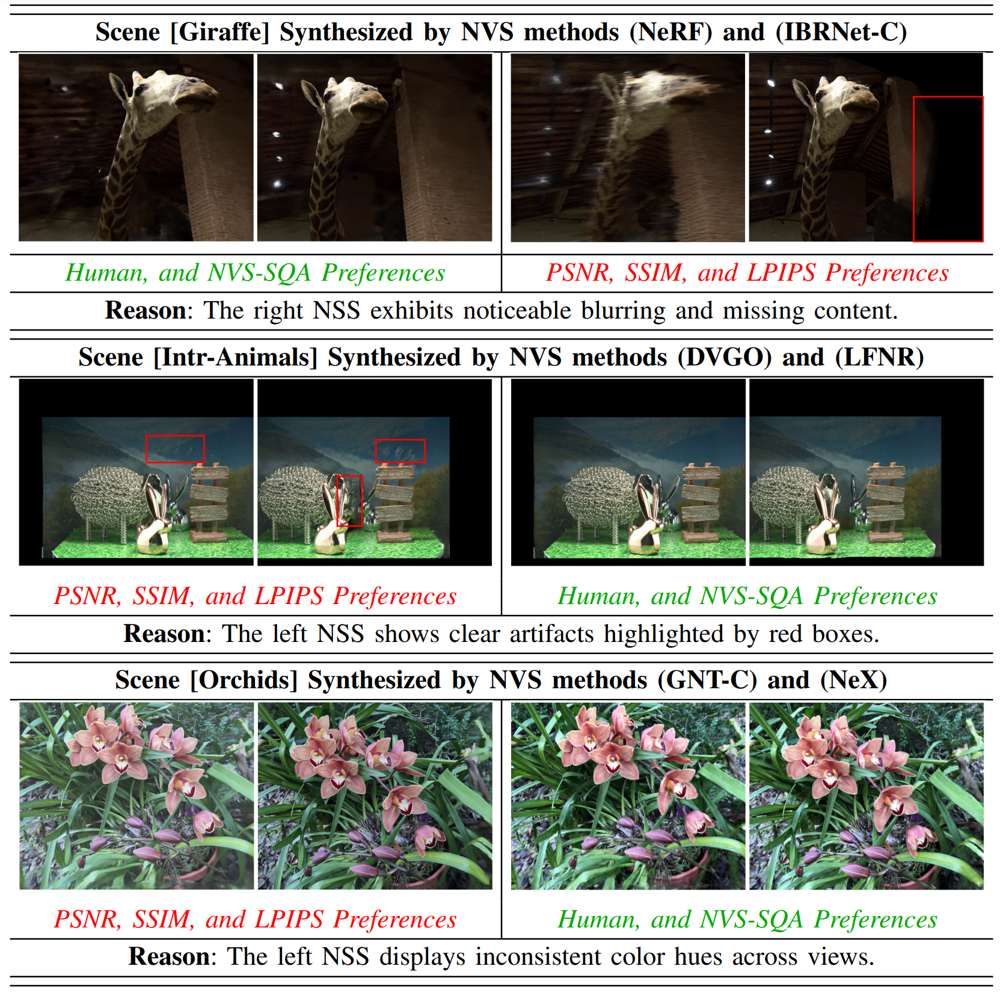

# NVS-SQA

Official implementation of "NVS-SQA: Exploring Self-Supervised Quality Representation Learning for Neurally Synthesized Scenes without References" [arxiv](https://arxiv.org/abs/2501.06488)).


### New: you can now install it via pip!

Please redirect to the [develop repo](https://github.com/VincentQQu/nvs_sqa) for details.

#### Installation

You can install the package directly from PyPI:

```bash
pip install nvs_sqa
```

#### Usage

The package can be used programmatically. You can download the examples folder [here](https://github.com/VincentQQu/NVS-SQA/tree/main/examples). Here's an example of how to generate quality features and scores:

```python
import nvs_sqa

# Initialize the QualityAssessor
qa = nvs_sqa.QualityAssessor()

# Define the evaluation folder path containing NSS directories
eval_folder = "./examples"

# Generate quality features
all_feats, save_path = qa.generate_quality_features(eval_folder, verbose=True)

# Compute quality scores
quality_scores = qa.generate_quality_scores(all_feats, verbose=True)

print(f"Features saved to: {save_path}")
```


#### Visualization of Some Examples:




### Requirements

numpy==1.24.1
opencv_contrib_python==4.8.0.76
opencv_python==4.8.0.76
Pillow==10.2.0
pyfvvdp==1.2.0
scikit_learn==1.3.0
scikit_video==1.1.11
scipy==1.12.0
tabulate==0.9.0
torch==2.0.1+cu118
torchsummary==1.5.1
torchvision==0.15.2+cu118

### Evaluate the Pretrained Model

Execute `python3 evaluate.py` to obtain datasetwise and scenewise experiment results.

#### One Linear Model for Three Datasets

#### Performance on Each Dataset

| Metric   | Fieldwork | LLFF   | Lab    |
| -------- | --------- | ------ | ------ |
| *SRCC* | 0.9111    | 0.7000 | 0.7000 |
| *PLCC* | 0.8828    | 0.6441 | 0.6783 |

#### Performance on Each Scene

| Scene | Animals | Bears  | CD-Occ. | Cd_occlusion_intr | Dinosaur | Elephant | Fern    | Flower | Fortress | Giraffe | Glass  | Glossy_animals_extr | Horns  | Leaves | Leopards | Metal  | Naiad-Sta. | Orchids | Puccini_statue | Room   | Toys   | Trex   | Vespa  | Whale  |
| ----- | ------- | ------ | ------- | ----------------- | -------- | -------- | ------- | ------ | -------- | ------- | ------ | ------------------- | ------ | ------ | -------- | ------ | ---------- | ------- | -------------- | ------ | ------ | ------ | ------ | ------ |
| SRCC  | 0.5000  | 0.9000 | 0.8000  | 0.1000            | 0.8000   | 1.0000   | 0.0000  | 0.9000 | 0.7000   | 0.9000  | 0.9000 | 0.9000              | 0.9000 | 0.7000 | 0.9000   | 0.8000 | 0.9000     | 0.8000  | 0.8000         | 0.7000 | 0.9000 | 0.9000 | 1.0000 | 1.0000 |
| PLCC  | 0.2545  | 0.7628 | 0.8159  | 0.0470            | 0.8035   | 0.9944   | -0.3679 | 0.7713 | 0.6554   | 0.9361  | 0.9735 | 0.9432              | 0.7288 | 0.8445 | 0.9395   | 0.7438 | 0.8370     | 0.9498  | 0.7087         | 0.7369 | 0.9704 | 0.8341 | 0.9901 | 0.9734 |

### Generating No-Reference Quality Representations with the Pretrained Model

To generate quality features for example Neurally Synthesized Scenes (NSS), follow these steps:

1. **Run the Application**: Execute `python3 app.py`. This script processes each NSS folder within the `./examples` directory.
2. **Feature Generation and Saving**: The script iterates through all NSS folders in `./examples`, generates quality features for each, and saves these features in `./examples/output_features.npz`. `output_features.npz` is in format of {<nss_name>: 384-dim rep., ...}. (You can use `np.load()` to load it.)
3. **Example NSS Provided**: Within the `examples` folder, we include two NSS examples: one generated by GNT-Cross-scene and the other by Plenoxel.
4. **Quality Score Output**: `app.py` also calculates and outputs quality scores based on the generated features applying a ridge linear regression model on training segements of Fieldwork, Lab, and LLFF datasets.

#### Important Notes:

- **JOD Scoring Format**: The JOD score, which is the adopted scoring format, features primarily negative values (offset by reference quality), with higher scores indicating better quality.
- **Relevance of JOD Scores**: According to the dataset authors for Fieldwork and Lab, JOD scores are more meaningful within the same scene, suggesting that cross-scene comparisons of JOD scores may not provide meaningful insights.

### Training the Model via Self-Supervised Learning

Our model was developed using a dataset sourced from Nerfstudio. For detailed instructions on obtaining this dataset, visit [Nerfstudio&#39;s Dataset Quickstart](https://docs.nerf.studio/quickstart/existing_dataset.html).

#### Installation of Nerfstudio

Follow the installation guide provided on the [Nerfstudio Installation Page](https://docs.nerf.studio/quickstart/installation.html) to set up Nerfstudio on your system.

#### Dataset Generation for Self-Supervised Learning

After installing Nerfstudio, execute the following steps to automatically prepare the dataset for self-supervised learning:

1. Download the source data: `ns-download-data nerfstudio --capture-name all`
2. Unzip each scene into the `datasets/nerfstudio` directory.
3. Run the preprocessing script: `python3 preprocess.py`

Note: Generating the unlabeled Neurally Synthesized Scenes (NSS) may take several days. Adjust the `nerfstudio_scenes` and `nerfstudio_methods` variables in the `consts.py` file to select specific scenes and NeRF methods for generation. The approximate processing times per method per scene are as follows:

- **splatfacto**: ~5 mins
- **instant-ngp**: ~20 mins
- **nerfacto**: ~15 mins
- **tensorf**: ~20 mins
- **kplanes**: ~30 mins
- **nerfacto-huge**: 3 hrs

#### Training Process

Modify parameters such as `version`, `batch_size`, and `seq_model_config` in `train.py`. Execute the training script with `python3 train.py`.

#### Model Evaluation

After training, update the `version` and `epo_offset` in `evaluate.py` to match your trained model's version and epoch number. Evaluate the pretrained model by running `python3 evaluate.py`.


### To Cite
<pre>

@article{qu2025nvs,
  title={NVS-SQA: Exploring Self-Supervised Quality Representation Learning for Neurally Synthesized Scenes without References},
  author={Qu, Qiang and Shen, Yiran and Chung, Yuk Ying and Cai, Weidong and Chen, Xiaoming and Liu, Tongliang},
  journal={arXiv preprint arXiv:2501.06488},
  year={2025}
}

@article{qu2024nerf,
  title={NeRF-NQA: No-Reference Quality Assessment for Scenes Generated by NeRF and Neural View Synthesis Methods},
  author={Qu, Qiang and Liang, Hanxue and Chen, Xiaoming and Chung, Yuk Ying and Shen, Yiran},
  journal={IEEE Transactions on Visualization and Computer Graphics},
  year={2024},
  publisher={IEEE}
}

@inproceedings{liang2024perceptual,
  title={Perceptual Quality Assessment of NeRF and Neural View Synthesis Methods for Front-Facing Views},
  author={Liang, Hanxue and Wu, Tianhao and Hanji, Param and Banterle, Francesco and Gao, Hongyun and Mantiuk, Rafal and {\"O}ztireli, Cengiz},
  booktitle={Computer Graphics Forum},
  volume={43},
  number={2},
  pages={e15036},
  year={2024},
  organization={Wiley Online Library}
}
</pre>
